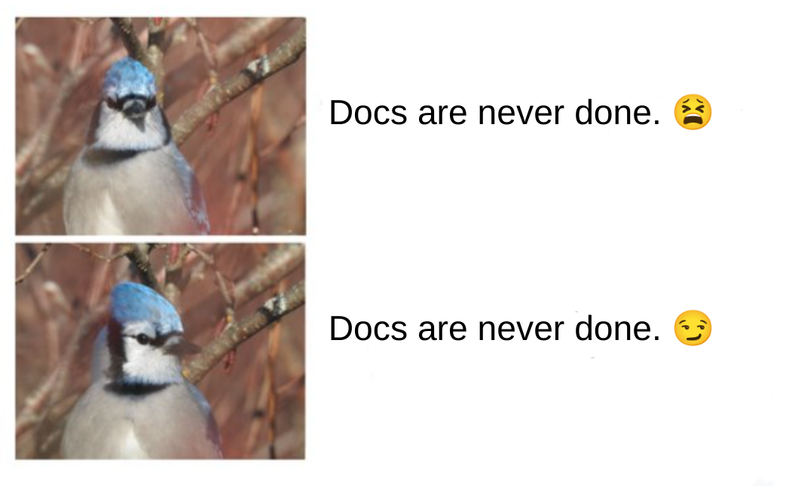
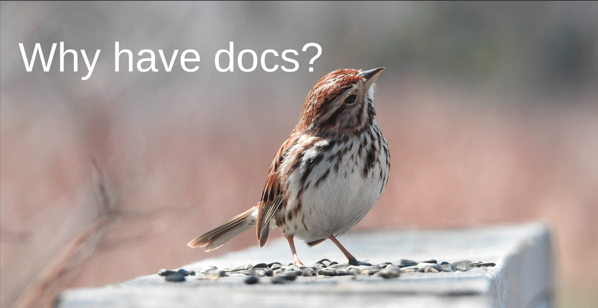
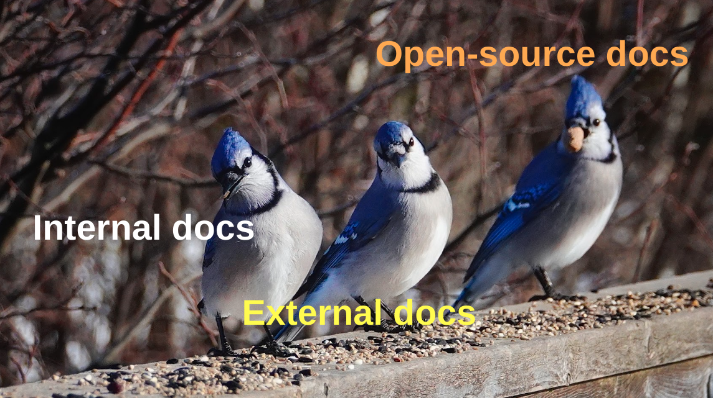
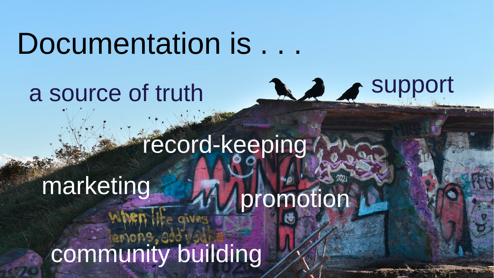
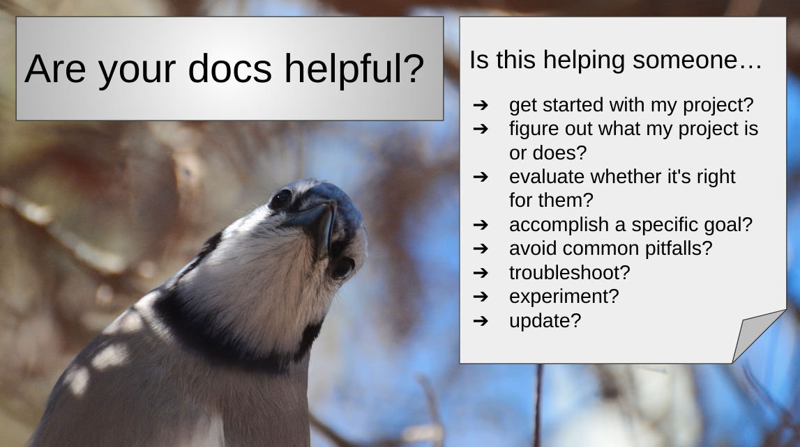
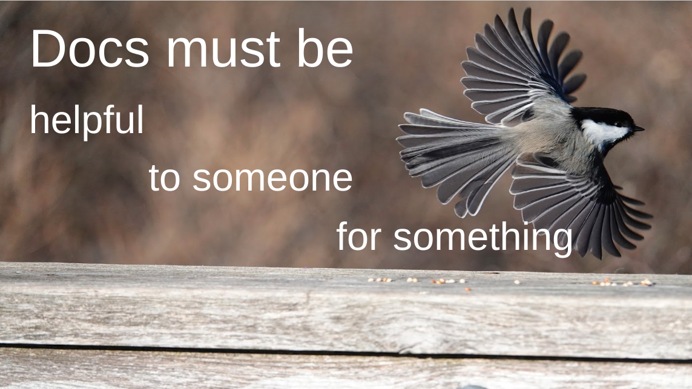
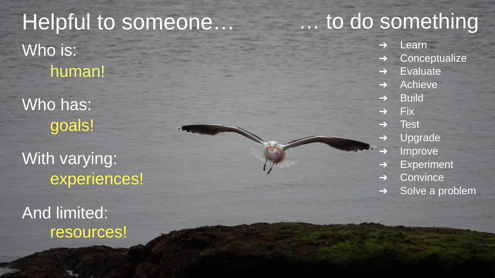
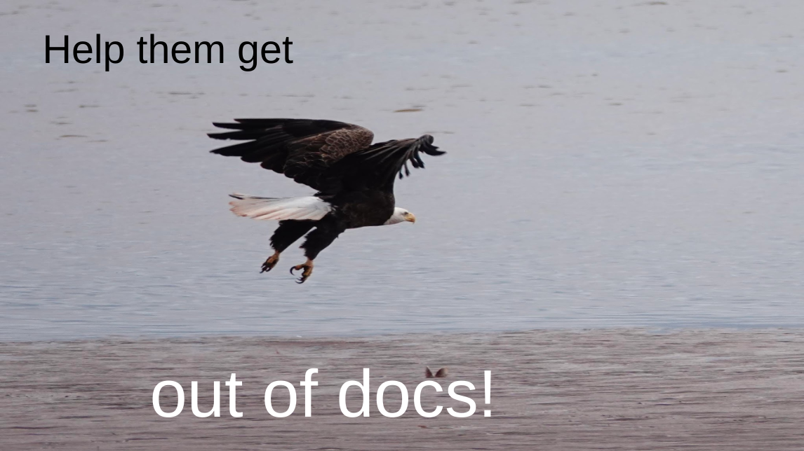
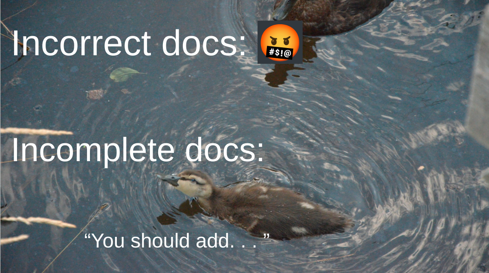
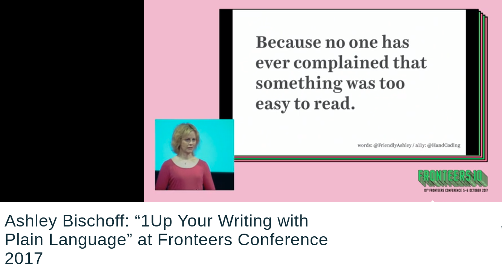

*(approximate transcript below, in "speaker notes" formatting rather than properly written, with some slides sprinkled in)*

I'm going to ask a question for and we'll get back to the answer a little later.

"Are your docs... good?"

Whether your current docs are...
- a README
- a few markdown files
- a Discord server
- a CHANGELOG
- the code itself
- an entire website
- ... or nothing at all!

... they can *always* get better!

Not what you wanted to hear, right? This actually sounds pretty overwhelming... OR... is it a COMFORTING fact that "docs are never done"... so don't expect them to be! You'll never get there! You CAN'T get there.

**You don't have to WORRY about getting there.**

With docs, you CANNOT, you must not, let "the perfect" be the enemy of:
- the good.
- the good *enough*.
- the #NWTWWHB. (Not worse than what we had before)

My name is Sarah, and I’m the docs lead at Astro.

I hope in just a few minutes' time, you'll see how achievable "better" docs are, even without:

- ... a technical writer
- ... a team of volunteers
- ... writing experience
- ... a lot of time

Whether you're:

- ... crafting your very first README
- ... adding the changeset for your next PR
- ... preparing a guide for using a new feature
- ... starting to think about redesigning your entire documentation site (hint: Starlight!)
 
  
I'm going to make your docs better, I'm going to make YOU a better, more confident docs writer, without doing much WRITING at all!

Why do projects have documentation? Why do *you* have docs, if you do, for your project?

You might have said, "to tell people how to use the project" or "to show what the project can do" or "explain what it is"

I would argue, the sole purpose of documentation, the only reason it exists, is to be helpful.

- **internal docs:** help with cross-team collaboration and onboarding
- **external docs:** help people understand, evaluate and use your project
- **open source docs:** help people contribute to your project

Documentation even helps **you** as you're building, making design decisions, learning, and leaving yourself notes.

Documentation is... a source of truth, docs is support, docs is record-keeping, docs is even marketing, promotion and community building ... 

... but ultimately docs **exist** to *help*.

Remember when I asked at the beginning, "Are your docs 'good'?" How did that make you feel? Was that an easy question to answer?

What if I ask instead, "Are your docs *helpful*"?

For many people, I think that second question feels different.

Change the question you ask yourself from....

"Are my docs 'good'?" 
- vague uneasiness and anxiety
- What does that even mean? 
- Focused inward, on yourself: I'm not a writer! 
- I'm not a native speaker! I’M not the person who should be writing docs!

 "Are my docs 'helpful'?"
- a more objective measure
- don't need to know or care about "docs theory"
- Focused outward, on other people: what do they need?

Because remember: YOU ARE the foremost expert on your project, and you are the BEST person to help! 

Changing the question you ask will immediately put you on the path to "better" docs... more helpful docs!

Notice that this ALSO changed the task of making docs from primarily a *writing* task to a *helping* task!

## "Are your docs helpful?" 

So how do we answer this question?

We begin to answer it by first understanding that it's really a collection of questions, that start with the phrase:

Is this helping someone...
- get started with my project
- figure out what my project is or does?
- evaluate whether it's right for their needs? (so you get the *right* users in the first place!)
- accomplish their OWN goals using MY project (e.g. add authentication to password protect some pages)
- troubleshoot something in their project that's not working as expected
- use my project to the fullest
- avoid common pitfalls
- keep up with the latest changes in my project, so they can successfully update *their* project

Evaluating whether your docs are
- HELPFUL
- helpful TO SOMEONE
- helpful to someone FOR SOMETHING

... will get you further, faster, than any other single docs intervention.

Your docs can only be helpful **to someone** and that someone... 

Helpful TO SomeONE WHO IS:
- Human
- needs/wants/desires/hopes/dreams
- Mood
WHO HAS:
- Context
- goals/purpose
- Motivations, expectations
WITH A CERTAIN EXPERIENCE LEVEL WITH:
- Code
- The industry
- Your project
WITH VARYING
- Language proficiencies
- Bad experiences ("burned before")
- Pre- or (mis) conceptions
AND ONLY LIMITED
- Attention
- Patience
- Time 
- Energy
- Resources (internet speed/cap; hardware; money)

They also need to help someone **do something**:

- Learn
- Conceptualize
- Evaluate
- Achieve
- Build
- Fix
- Test
- Upgrade
- Improve
- Experiment
- Convince (themselves, someone else)
- Solve a business problem or technical challlenge

But, docs should ultimately be helpful at getting people OUT of docs, and back into (using) your project.

You probably already have an idea right now of something you could add to or change in your existing docsto make them **helpful**.

But let's go even further, and **define helpful documentation**:

1. CLEAR AND CORRECT

> Or in other words, if your docs are wrong, they are not helpful.

If docs are factually wrong, if they're misleading, if they're outdated, if they're correct but so confusing you'd never know it... they are not correct. They are WRONG. 

Now, when I say "correct", I do not mean **complete/comprehensive**.

In fact, you might have some existing documentation that . . . Isn’t really helping anyone do anything! 

 Action Items:

- Read every statement in your docs for ACCURACY
- Or, if you're starting fresh, ONLY WRITE TRUE STATEMENTS
- Go through each part of your docs and identify WHO this helps, and WHAT it helps them do
- Less is more: both in style AND in content
- Have you added EXTRA content that HIDES the good stuff, and makes it LESS clear what the reader does/doesn’t need to know?
- Use clear, simple language: No one ever complained, "Gee, these docs are just [too easy to read](https://vimeo.com/238673931#t=2045s)!"

If something sounds convoluted, overwhelming, or you're not sure whether it's entirely clear and correct, and you can't immediately see how to make it better... REMOVE IT: 

> *"No documentation means I go look somewhere else for information. Incorrect documentation means I waste my time."* - Mason Egger

Incorrect docs: reduce credibility, make people frustrated enough to stop using your project, and choose another; if your users can't be successful, then they do NOT use your project; they DON'T spread word of mouth (at least, not the good kind), they don't create items themselves that showcase your project, and they don't contribute back and improve your project.

If it's not clear, and correct... delete it! I am giving you permission! It wasn't helping you anyway! It was frustrating people trying to use your project and potentially generating ill will and bad vibes!

CHECK IN: Congratulations! You've made your docs better and you haven't written a single thing!

If you're worried you might have deleted something important, it's fine. It's the internet! Someone will tell you.

We're going to take things one step further and make your docs even more helpful:

2. Navigable and Discoverable

- Can people move around your documentation and find what they need?

- Are things where people expect to look? If they first look in the wrong spot, can they easily GET to the right spot?

This is also called Information Architecture, and you can get into things like "signposts", "escape hatches/off ramps". These are all the structural things we add to our documentation to help people quickly and easily situate themselves and move around.

Remember that a lot of people will enter your documentation via a web search, and not necessarily "on page one" [screenshot of book: every page is page one]. When someone finds you, can they get where they need to go before they lose hope.

The good news, if there's only one page, they can't be on the wrong page [thinking meme].

I'm serious! If you don't know how to structure your content, there is nothing wrong with one huge README to start! I mean, a table of contents would be nice? A logical order or flow helps. Putting "getting started" closer to the top and "removing your data and deleting your account" closer to the bottom kind of makes sense to me?

Here's where a framework like Diataxis comes in: by identifying parts of your documentation by **content type**, you can logically group sections of your docs. 

If the only reason docs exist is to be HELPFUL, to SOMEONE, trying to DO SOMETHING, then the first start of organizing your content is thinking about what your reader needs help doing, and making sure you can direct them to the material that actually helps them. e.g.:

- If they are coming to quickly look up a reference value, like a property name or config option, make sure they don't get stuck in your beginner tutorial
- If they want to learn about what you project is, and what needs it solves, don't make them get stuck in implementation details

But the key thing is, if someone is not reading your docs like a book, top-to-bottom, first-page to last-page, do you have a plan for how will they find your clear, correct information?

Action item:
- go to literally any random point in your documentation, and imagine you are a reader who is not in the right place to get the info you need for a particular goal. Think about how your docs could direct them there, quickly and accurately.
- Is this solved by a TOC? a search widget? a "How to read these docs" page? an internal link? a "not what you're looking for" UI component.
- If you have multiple pages or files, do the titles accurately represent the content? Does your content live under the title you'd expect.

NEW MVD SLIDE

So, at this point, I've now basically said: Don't lie (delete any lies), and don't hide stuff (if you have to, throw everything on a single page. Good news, CTRL+F works for everyone!).

I'm pretty sure this is STILL a bar you can reach!

If every statement in your docs is true, and people can find, read and understand what they mean... Congratulations! You have Min Viable Docs! (*whispers If you have to, you can stop now*)

But, of *course*, there *are* characteristics of good docs, and there are some pretty well-established anti-patterns.

There's no shortage of talks on "how to write good documenation" that go into specifics, and I DO recommend you check out some great ones if you want to get better at writing! But that can get overwhelming and we already know that WRITING is secondary to HELPING.

- It might feel like there's a scary Docs Police waiting to criticize you and that there aer a lot of potential failure pitfalls.
- Instead of thinking of these as things to worry about getting wrong, think of them as things that you DON'T have to worry about; things NOT TO DO because they are NOT YOUR JOB as a helper. 
- These things "thou shalt not do" actually REMOVE pressure and responsibility, and are guard rails to keep you focused on a productive path towards helping.

e.g. Bun example

So, you may have seen this social media post. I absolutely love it, because it perfectly demonstrated everything we'd been talking about here.

It’s CLEAR, and CORRECT. If you’re looking for the command to install Bun, these are the words you will search for! It introduces exactly what’s coming next, and it’s not hidden in a bunch of other words.

This edit is NOT me saying, "BAD OP, BAD DOCS!"

This edit is me freeing the OP from the responsibility to:
- write something clever
- motivate the reader
- get all the punctuation correct in longer, multi-clause sentences
- have 10 times as many words to proofread and spellcheck
- spend time "writing" instead of just "helping"

Similarly, many other "Docs 101 Don'ts" are actually "don't worry abouts!" 

1. Don't use "we", because you're not sitting there with your potentially frustrated reader
    - This frees you from the extra work of checking that all your we/us/our/let's all agree. You know what's super easy to check? You and your.
    - Using "you" also naturally puts the emphasis on your reader, and what they are doing. It guides you to thinking about helping THEM. (What might THEIR set up look like? instead of writing "our" which can trick you into thinking about your OWN context or situation.)
    - Often, these instructions work without any "you" at all, and become even clearer.

2. Don't use "should" - decide whether your reader MUST do something (mandatory), "could optionally choose to" (only when a true choice!) etc.
    - Again, sounds like a rule we just made up! But I guarantee you that we are freeing you from feedback from the confused reader!
    - Do I... have to do this? What happens if I don't, and how bad is that?
    - Your sentences ALSO get clearer! "You should create a new folder for your blog posts" -> Create a new folder for your blog posts.
    - Why waste time your own time getting the nuance of an instruction perfectly correct? We are giving you permission to avoid writing, and just tell someone directly what to do! Even when more things are possible, if you WANT them to do this to have a successful outcome, just say it that way. WE FREE YOU from the responsibility of describing every possible path when you, the expert in your own project, already have a recommendation. You can help. Don't write. Just help.

ACTION ITEMS:

- Don't stress out about writing rules, but embrace them as telling you things that aren't your responsibility!
- Pick one or two (I suggest "we" and "should"), or just read through your docs looking for things that aren't your responsibility, and remove them!

---- 
If docs' only purpose is to be helpful, then the existence of docs is a PROMISE OF HELP. 

If you want to up your docs game...

Pay attention to the promises your docs are making, and evaluate whether they keep that promise:
- do getting started instructions have all the key steps that someone new to your project needs 
- is your API reference easily scannable so someone can quickly look up a value and get back to building
A broken promise is worse than no promise at all.

In conclusion, think of yourself as a HELPER. Someone who just happens to be helping in writing.
- helpers don't need to entertain or write beautiful stories
- they need to make CLEAR, CORRECT information available. Ideally in such a way that readers can DISCOVER, and NAVIGATE it. (CTRL+F is your friend!)

And The best help is CONTEXTUAL: it is FOR someone who is trying to DO something specific.
- this person may also not be in the greatest state to RECIEVE help, but they need it.
- don't overwhelm. Less is always more.
- You can probably improve your docs RIGHT NOW by *deleting*, not writing more!
    - delete words like "should"; delete outdated or unmaintained docs, even if you can't yet replace them; delete entire pages if you are afraid people won't find them, and put everything on one page if you need to!
